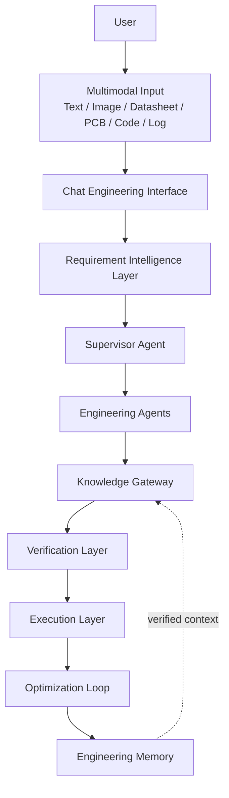
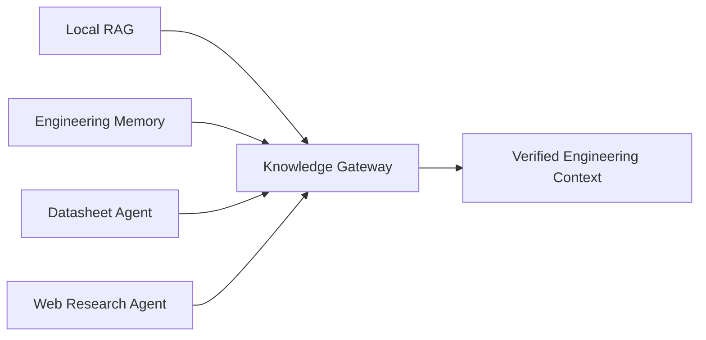
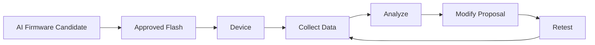
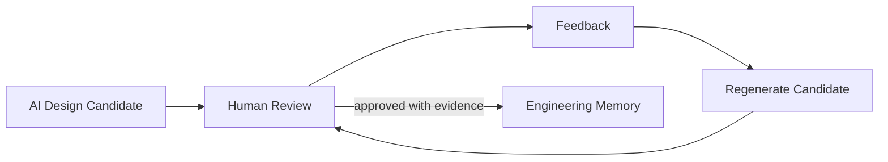

# Embedded Copilot Agent

## Product Positioning

Embedded Copilot Agent 的最终愿景是 RAG + Multi-Agent + Multimodal AI Engineering Assistant：将工程对话、可追溯知识、受控工具和验证流程组织成嵌入式研发助手，而不是把 LLM 直接连接到文件、命令或设备。

目标生命周期为：Requirement → Architecture → Hardware → PCB → Firmware → Build → Debug → Test → Optimization → Engineering Memory。

> 状态说明：本文同时描述当前实现基础与最终愿景。除非标为“已发布”或“开发分支已实现”，其余能力均为路线图，不得据此视为现有功能。

## 1. Overall System Architecture

当前已发布架构以独立 Runtime、公开 Port、冻结 DTO、审计与受控 Workspace 写入边界为主。图中 Agent 编排、完整多模态接口和闭环执行属于分阶段目标。

## 2. Engineering Chat Interface

工程接口的目标能力包括文本对话、文件上传、图像理解、Datasheet/PCB/代码分析和日志调试。输出不是普通聊天回答，而是：Requirement Analysis、Architecture Proposal、Hardware Recommendation、Risk Analysis 和 Next Action。

v0.49 是开发分支已实现但未发布的 Engineering Interface Layer，范围包括 Engineering Workspace、Interface Contracts、Human Feedback Projection 和 Progress Events。其稳定公开接口仍以发布版本和测试证据为准。

## 3. Requirement Intelligence Layer

目标 [[Requirement Agent]] 将自然语言转化为工程规格 PRD：功能、性能、功耗和接口需求。Engineering Planning Agent 负责任务分解、依赖分析、时间估算和风险预测；System Architecture Agent 生成系统框图、组件关系和数据流；Interface Contract Agent 定义软硬件接口、通信协议、GPIO 映射和数据格式。

v0.50 是开发分支已实现、未发布的 Engineering Intelligence Layer，涵盖 Requirement Intelligence、Planning、Knowledge Context 与 Memory Projection。它不自动确认需求真实性或绕过人工评审。

## 4. Supervisor Agent

[[Supervisor Agent]] 是目标中央编排系统，负责 Agent 调度、任务规划、显式状态管理和失败恢复。其状态为 `PENDING`、`RUNNING`、`SUCCESS`、`FAILED`、`TIMEOUT`、`RECOVERY`、`WAIT_HUMAN`。它不直接执行 Shell、读写工程文件或控制硬件；外部能力须经受控契约。

## 5. Engineering Agent Layer

目标专业层由 Hardware、Firmware、PCB、Debug、Test 与 Optimization Agent 组成。每个 Agent 只返回边界明确、带证据和置信度的结构化候选；验证前不得声称硬件、PCB、固件或优化结论已成立。

当前状态：Debug/Verification Runtime 基础已存在；Hardware、PCB、Test、Optimization 的完整 Agent 化能力为路线图。[[Firmware Agent]] 的 ESP-IDF、STM32 HAL、FreeRTOS 支持也应以实际发布实现为准。

## 6. Knowledge Gateway

[[Knowledge Gateway]] 的目标是融合 Local RAG、[[Engineering Memory]]、Datasheet Agent 与 Web Research Agent，输出带来源与验证状态的工程上下文。

- Local RAG：Datasheet、Reference Manual、SDK、Application Note。
- Engineering Memory：历史设计、调试案例、失败经验、优化参数。
- Web Research Agent：官方文档、GitHub issues、论文、最新 SDK。
- Datasheet Agent：GPIO、电源、时序、寄存器、接口。

本仓库的 v0.39 Engineering Memory 已发布，但它是进程内参考 Store，不等同于完整 RAG 融合或自动知识采集。

## 7. Hardware Engineering Layer

目标层包括 Hardware Agent、System Architecture Agent、Interface Contract Agent、BOM Agent、Schematic Generator、PCB Agent 与 PCB Reverse Engineering Agent。输入可包括 PCB 图像、Gerber、ODB++；目标输出是 PCB 分析、网表候选和原理图恢复建议。

v0.51 是 Hardware Engineering Proposal 与 Hardware Agent Contract 的设计/实现里程碑，尚未发布。EDA 文件解析、网表恢复与原理图生成均为路线图，不能替代 DRC/ERC 或电气测量。

## 8. Firmware Engineering Layer

目标 [[Firmware Agent]] 支持 ESP-IDF、STM32 HAL、FreeRTOS，并按 `firmware/`、`driver/`、`bsp/`、`application/` 组织候选实现。生成结果必须标明平台与执行上下文；没有真实构建/硬件证据时只能称为建议或候选。

## 9. Execution Layer

目标 Tool Agent 将通过受控适配器连接 KiCad CLI、ESP-IDF、PlatformIO、OpenOCD 与 Git；Build Agent 负责 compile、link、package；Flash Agent 处理烧录；Debug Agent 分析 crash、UART log、编译错误和运行时失败。

当前 Tool Runtime 只提供受控工具执行契约基础。真实构建、Git 操作、烧录、复位与硬件控制均是路线图，必须具有权限、审计、超时、取消与人工批准。

## 10. Verification Layer

[[Verification Agent]]（v0.38 已发布）提供确定性候选验证基础。目标硬件验证包括电源、保护、接口、EMI；软件验证包括内存安全、API 与可靠性；Test Agent 的目标覆盖软件单元/性能测试及硬件电压、电流、信号测试。

`PASS` 不自动等同真实设备通过：它描述已执行规则的结果。真实测量、测试环境与证据仍应被记录。

## 11. Hardware Intelligence Loop

HIL Agent、Digital Twin 的仿真、预测与优化均为未来路线图。循环中的烧录与修改必须经人类批准和受控执行；没有设备数据不得把预测当作观测事实。

## 12. Optimization Layer

PID Optimization Agent、Power Optimization Agent 与 Performance Optimization Agent 是路线图。目标优化指标为 Power、FPS、RAM、Flash、CPU 和 Latency。优化提案必须保留基线、约束、指标、实验条件和验证结果。

## 13. Human Feedback Loop

人类反馈是工程控制点，而非仅用于改写文本。批准应绑定方案、证据、权限与时间，不能被其他请求复用。

## 14. Engineering Memory

[[Engineering Memory]] 是最终知识积累层，目标保存设计决策、问题、解决方案、失败尝试与优化结果，形成后续项目可检索的工程智能基础。已发布 v0.39 实现候选与已验证记录隔离，且不直接调用 Agent、LLM、RAG、工具、文件系统、网络或硬件。

## 15. Current Implementation Mapping

| 版本/里程碑 | 状态 | 范围 |
| --- | --- | --- |
| v0.39 | 已发布 | Engineering Memory Layer |
| v0.49 | 开发分支已实现，未发布 | Engineering Interface Layer |
| v0.50 | 开发分支已实现，未发布 | Engineering Intelligence Layer |
| v0.51 | 设计/实现里程碑，未发布 | Hardware Engineering Proposal、Hardware Agent Contract |
| v1.0 | 路线图 | End-to-end Engineering Loop |
| v1.1 | 路线图 | React Console、FastAPI Integration |
| v1.2 | 当前开发里程碑 | AI Runtime Core、Engineering Chat、Feedback/Event Projection |

未来 Firmware、PCB、Execution、HIL 与 Optimization 层必须在独立范围、权限模型、接口契约和测试计划获批后实施。
