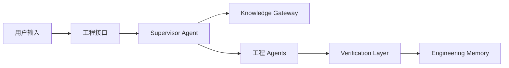

# 系统架构

当前实现以独立 Runtime 和公开 Port 协作；目标架构由 [[docs/knowledge/02_Agent_Design/supervisor-agent|Supervisor Agent]] 编排工程 Agent，并经 [[docs/knowledge/03_Knowledge_System/rag|Knowledge Gateway]]、验证与受控执行层形成闭环。目标架构不改变当前运行时边界。

参见 [[docs/knowledge/01_System_Architecture/data-flow|Data Flow]] 与 [[docs/knowledge/01_System_Architecture/engineering-workflow|Engineering Workflow]]。
