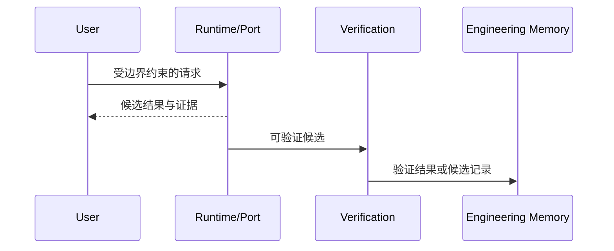

# Data Flow

工程输入应经过显式 DTO、来源标识与权限边界。知识检索返回可追溯上下文；Agent 输出是候选方案；验证与人工审批决定是否可进入 [[docs/knowledge/99_Memory/engineering-memory|Engineering Memory]]。当前实现不允许 LLM 直接读取文件、执行命令或控制硬件。

```mermaid
sequenceDiagram
 participant U as User
 participant R as Runtime/Port
 participant V as Verification
 participant M as Engineering Memory
 U->>R: 受边界约束的请求
 R-->>U: 候选结果与证据
 R->>V: 可验证候选
 V->>M: 验证结果或候选记录
```
